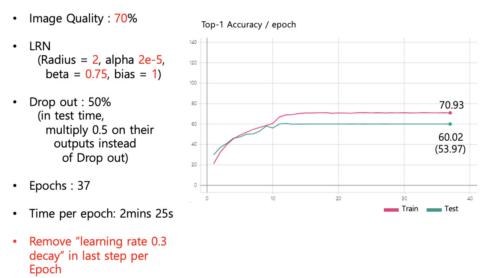

# Alexnet-tf2

Implemented "ImageNet Classification with Deep Convolutional Neural Networks (NIPS 2012)" a.k.a. Alexnet using tf2.
(I have implemented their customized nesterov gradient descent optimizer, but do not implemented Distributed learning design.)

I have confirmed that Top-1 validation error using 1-CNN model is achieved 40.8% as described in Table 2 in the paper.

