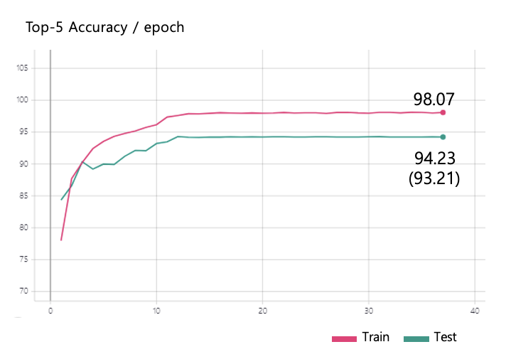

# Alexnet

Implemented "ImageNet Classification with Deep Convolutional Neural Networks (NIPS 2012)" a.k.a. Alexnet using tensorflow2.

# Note

- I have implemented their customized nesterov gradient descent optimizer, but do not design distribution learning.

- As shown below, the top-1 validation error using 1-CNN model achieved 39.98, similar to that described in Table 2 of the paper (40.7).

    

- Top 5 validation error acheived 5.77 because I have used only 10 classes to train and validate the model.
    
